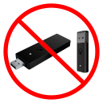
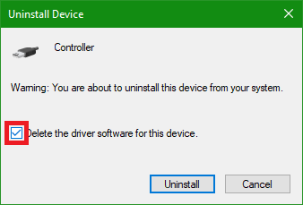

# Manual WinUSB Install Instructions
<!-- Provided in a separate file to make it less directly visible, as this should ideally only be used as a fallback -->
RB4InstrumentMapper is capable of installing the WinUSB driver on Xbox One devices directly, through the `Configure Devices` button on its main menu. However, if you run into any issues, it is possible to install the driver manually as an alternative.

## Warning

***DO NOT INSTALL THE DRIVER ON YOUR XBOX ONE RECEIVER!!!*** 

RB4InstrumentMapper is not capable of handling it in this state, and it will become nonfunctional until you uninstall the device in Device Manager!

The driver should only be installed on the Wireless Legacy Adapter and Guitar Hero Live dongle.

## Install WinUSB

1. Download [Zadig](https://zadig.akeo.ie/) and run it.
2. Under Options, enable `List All Devices`.

   

3. Select your device from the dropdown list.

   

4. Change the box to the right of the green/orange arrow to the `WinUSB` driver.

   

5. Hit `Replace Driver` and wait for it to finish.
6. Repeat for any additional peripherals you wish to use.

You can now use the device in RB4InstrumentMapper. Note that games that natively support the device will no longer work directly with it until you uninstall the WinUSB driver, you will have to use RB4InstrumentMapper.

## Remove WinUSB

1. Press the Windows key + X and select `Device Manager`.

   

2. Expand the `Universal Serial Bus devices` category and find the device you want to reset.

   

   - If this category is not present, you may need to look in the `Other devices` category instead. In particular, if you're here to fix a failed revert from within the `Configure USB Devices` menu, this is where it will most likely be located.

3. Right-click the device and hit `Uninstall device`.

   

   - If a checkbox that says `Delete the driver software for this device` is displayed on the confirmation dialog, be sure to click it.

     

4. After confirming and restarting your PC, the device should now appear under the `Xbox Peripherals` category.

   

The device is now restored to its original state. Games that natively support the device will work with it again, but RB4InstrumentMapper will no longer be able to make it usable in other games.
